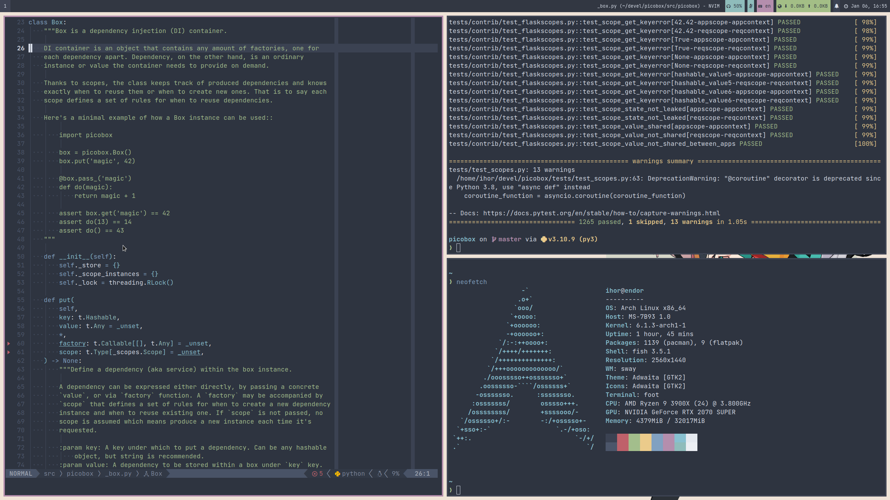
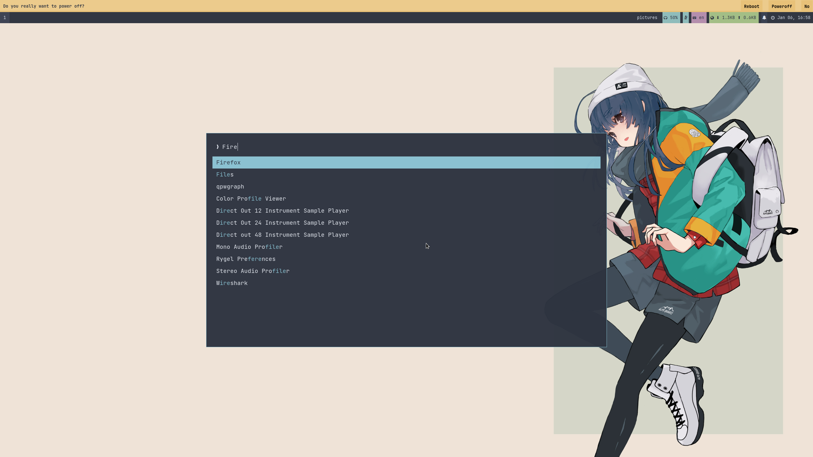

# @ikalnytskyi's dotfiles

In the Unix world programs are commonly configured in two different ways, via
command line arguments or text based configuration files. Programs with many
options like window managers or text editors are configured on a per-user basis
with files in your home directory (`~`). In unix like operating systems any
file or directory name that starts with a period or full stop character (`.`)
is considered hidden, and in a default view will not be displayed. Thus the
name **dotfiles**.


## Table of Contents

 * [Managing](#managing)
 * [Configuration packages](#configuration-packages)
 * [Screenshots](#screenshots)


## Managing

This repository is managed by [GNU Stow], a free, portable, lightweight symlink
farm manage. Unlike many other management tools, GNU Stow can be found in most
Linux distributions. macOS users can install via homebrew.

 | OS     | Install                           |
 | ------ | --------------------------------- |
 | Arch   | pacman -S stow                    |
 | Ubuntu | apt-get install stow              |
 | Fedora | dnf install stow                  |
 | Alpine | apk add stow                      |
 | macOS  | brew install stow                 |

So how to apply configurations from this repository?

 * First, you have to clone the repository and change directory to it.

   ```console
   $ git clone https://github.com/ikalnytskyi/dotfiles
   $ cd dotfiles
   ```

 * Second, you have use `stow` to create symlinks in your home directory to
   point to the configuration stored in the repository. Please note, `stow`
   doesn't provide a single command to apply all configurations. You have to
   choose what *configuration package* you want to apply first.

   Each configuration package is stored in the separate directory in the
   repository root and is named after the software it stores configuration for.

   ```console
   $ stow -t ~ {package}
   ```

   See [configuration packages](#configuration-packages) for the whole list
   of configuration packages stored here.

[GNU Stow]: https://www.gnu.org/software/stow/


## Configuration packages

 * [bash](https://www.gnu.org/software/bash/)
 * [bat](https://github.com/sharkdp/bat)
 * [dunst](https://dunst-project.org/)
 * [environment.d](https://www.freedesktop.org/software/systemd/man/environment.d.html)
 * [fish](https://fishshell.com/)
 * [foot](https://codeberg.org/dnkl/foot)
 * [fuzzel](https://codeberg.org/dnkl/fuzzel)
 * [git](https://git-scm.com/)
 * [helix](https://helix-editor.com/)
 * [i3status-rust](https://github.com/greshake/i3status-rust)
 * [imv](https://sr.ht/~exec64/imv/)
 * [mako](https://wayland.emersion.fr/mako/)
 * [mc](https://midnight-commander.org/)
 * [nvim](https://neovim.io/)
 * [rofi](https://davatorium.github.io/rofi/)
 * [starship](https://starship.rs/)
 * [swappy](https://github.com/jtheoof/swappy)
 * [sway](https://swaywm.org/)
 * [swayidle](https://github.com/swaywm/swayidle)
 * [swaylock](https://github.com/swaywm/swaylock)
 * [swaynag](https://github.com/swaywm/sway/tree/master/swaynag)
 * [systemd](https://systemd.io/)
 * [tmux](https://github.com/tmux/tmux/wiki)
 * [vscode](https://code.visualstudio.com/)
 * [waybar](https://github.com/Alexays/Waybar)
 * [wofi](https://hg.sr.ht/~scoopta/wofi)
 * [xdg-desktop-portal-wlr](https://github.com/emersion/xdg-desktop-portal-wlr)
 * [zathura](https://pwmt.org/projects/zathura/)
 * [zellij](https://zellij.dev/)


## Screenshots



